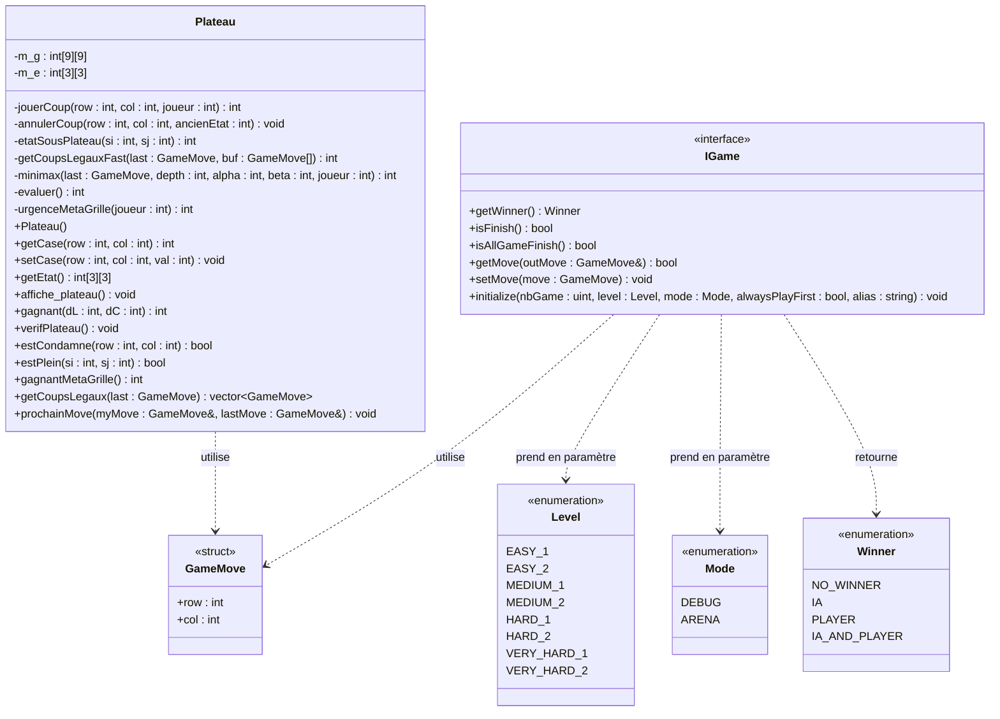

# Diagramme de classe — TicTacToeAI-AGA

## Légende des relations

| Symbole | Signification |
|---|---|
| `..>` | Dépendance (utilise dans une signature) |
| `<<interface>>` | Classe abstraite pure — ne peut pas être instanciée |
| `<<struct>>` | Structure de données simple |
| `<<enumeration>>` | Énumération |
| `-` | Membre privé |
| `+` | Membre public |

## Notes

- `IGame` est fournie par le prof via `libUTTTLib.a`. Notre code n'en voit que l'interface.
- `Plateau` est la seule classe que nous avons écrite. Elle contient **toute** la logique IA.
- `GameMove` est le type d'échange universel : notre IA lit le coup adverse (`getMove`) et envoie le sien (`setMove`) via ce struct.
- La variable globale `extern IGame& game` est définie dans `libUTTTLib.a` et utilisée dans `main.cpp`.
